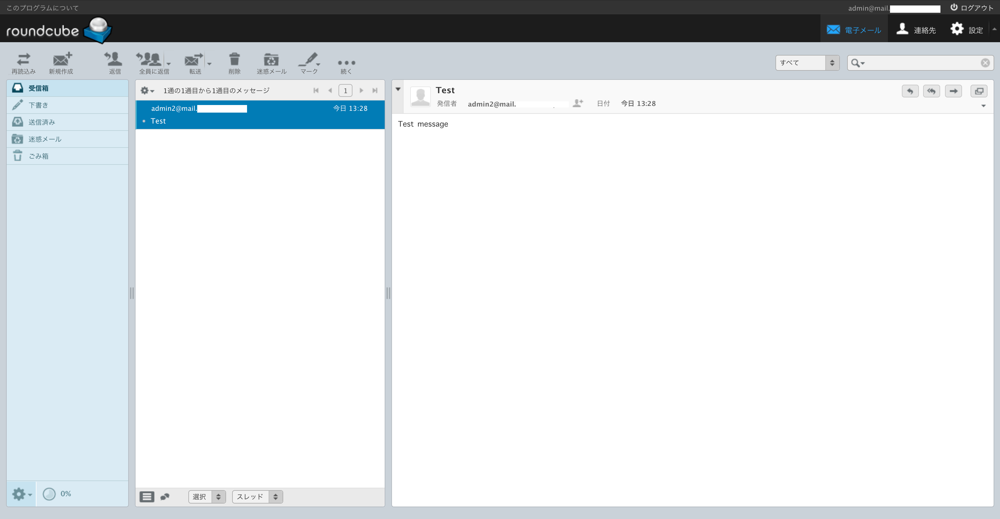

# Tutorial-Mailu

---

Web メーラー付きのメールサーバーである Mailu を構築する手順。インストール先は Azure の VM。

---

## 1. 仮想マシンをセットアップ

[Azure ポータル](https://portal.azure.com)を開き、Debian の VM を用意する。

### 1.1. Debian の初期設定

初期設定のポイントは以下の通り。

- 公開鍵認証の SSH で VM に入れること
- 不必要なポートが空いていないこと
- グローバル IP アドレスが固定されていること
- インストール済みのパッケージが最新になっていること `$ sudo apt update && sudo apt upgrade -y`

### 1.2. Docker をインストール

公式サイトの手順を基に、[Docker](https://docs.docker.com/engine/install/)と[Docker Compose](https://docs.docker.com/compose/install/)をインストールする。

### 1.3. ファイアウォールを設定

Mailu で使用する以下の TCP ポートを開放する。

- 22
- 80
- 443
- 465
- 587
- 110
- 143
- 993

## 2. ドメインを取得

DNS レコードを設定する必要があるため、メールサーバーに割り当てるドメインを取得する必要がある。

DNS レコードには、以下の設定を行う。

| ホスト名         | TYPE | VALUE / MX 優先                            |
| ---------------- | ---- | ------------------------------------------ |
| example.com      | MX   | mail.example.com / 10                      |
| example.com      | TXT  | `v=spf1 ip4:＜グローバルIPアドレス＞ ~all` |
| example.com      | A    | ＜グローバル IP アドレス＞                 |
| mail.example.com | A    | ＜グローバル IP アドレス＞                 |

## 3. Mailu のセットアップ

### 3.1. 設定ファイルの生成

[Mailu configuration](https://setup.mailu.io/1.7/) にアクセスし、必要事項を入力すると、 `docker-compose.yml`と`mailu.env`の 2 つの設定ファイルが生成される。

設定項目のポイントは以下の通り。

| 項目                                                       | 値                           |                                                                                   |
| ---------------------------------------------------------- | ---------------------------- | --------------------------------------------------------------------------------- |
| pick a flavor                                              | Compose                      |                                                                                   |
| Main mail domain and server display name                   | mail.example.com             |                                                                                   |
| Opt-out of statistics                                      | ✓                            |                                                                                   |
| Linked Website URL                                         | example.com                  |                                                                                   |
| Enable the admin UI (and path to the admin UI)             | ✓<br>/admin                  | `mailu.env` の `WEB_ADMIN` の設定値が`/admin` に変更されているか確認しておく。    |
| Enable Web email client (and path to the Web email client) | roundcube<br>/mail           | 同上（既定の `` 、 `/` のまま有効化するとコンテナを起動した際にエラーが発生する） |
| Enable the antivirus service                               | ✓                            |                                                                                   |
| Enable fetchmail                                           | ✓                            |                                                                                   |
| IPv4 listen address                                        | ＜プライベート IP アドレス＞ |                                                                                   |
| Public hostnames                                           | mail.example.com             |                                                                                   |
| Which database back end would you like to use?             | postgresql                   |                                                                                   |

`Setup Mailu` ボタンを押すと、ファイルが生成され、利用手順が表示されるので、
それに従って VM にダウンロードする。

```sh
$ mkdir ./mailu
$ cd ./mailu
$ wget http://setup.mailu.io/1.7/file/＜GUID＞/docker-compose.yml
$ wget http://setup.mailu.io/1.7/file/＜GUID＞/mailu.env
```

### 3.2. Docker の操作

```
$ cd ./mailu
$ docker-compose -p mailu up -d

# 管理者アカウントを作成（メール送受信の確認用に2人分作っておく）
$ docker-compose -p mailu exec admin flask mailu admin admin mail.example.com ＜任意のパスワード＞
$ docker-compose -p mailu exec admin flask mailu admin admin2 mail.example.com ＜任意のパスワード＞
```

以下のページにアクセスして、動作確認する。

- [管理画面](https://mail.example.com/admin)
- [Web メーラー](https://mail.example.com/mail)



---

Copyright (c) 2020 YA-androidapp(https://github.com/YA-androidapp) All rights reserved.
